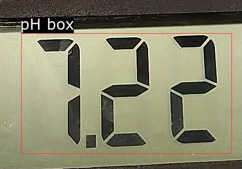
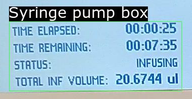

# Ad hoc titrator: extract readings from movie clip of syringe pump and pH meter

## Requirments
 - Ruby gems (working version):
   - ruby-vips (2.0.17)
   - streamio-ffmpeg (3.0.2)
   - rtesseract (3.1.2)
 - ssocr (2.19.0)
  See https://www.unix-ag.uni-kl.de/~auerswal/ssocr/

## Note on rtesseract
 Some OCR results will generate unicode characters and give error while doing RTesseract.to_box

 Current workaround:
 In method `parse_line(line)` of Box in box.rb, add
```
    line.force_encoding(Encoding::UTF_8)
```
 to force it into UTF-8.

## Examples of frame cropping and reading boxes for pH meter and syringe pump.
  - The crop of pH meter display needs to be clean. Including the dark border from above and below causes interference. Avoid reflections and optimize shooting angle for highest contrast possible.
  
    
  - The syringe pump screen crop needs to contain this part and only this part. Field picking is based on relative position of text fields. Current criteria:
     1. Field x value starts <> 50% of cropped box are dropped
     1. Fields with start of y values 20% ~ 40% if cropped box -> Remaining time
     1. that with x value starting < 85% (to drop the uL unit field) and y values starting > 75% -> Volume added
     
    
